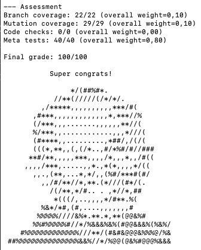

# Andy

[](https://github.com/SERG-Delft/andy/actions/workflows/tests.yml)

* [Summary](#andy)
* [Usage](#usage)
* [Configuration](#configuration)
  * [File structure](#file-structure)
  * [Weights](#weights-required)
  * [Classes under test](#classes-under-test-required)
  * [Mode](#mode)
  * [Code coverage](#code-coverage)
  * [Mutation coverage](#mutation-coverage)
  * [Meta tests](#meta-tests)
  * [Penalty meta tests](#penalty-meta-tests)
  * [Code checks](#code-checks)
  * [Penalty code checks](#penalty-code-checks)
  * [Success message](#success-message)
  * [External process](#external-process)
* [Team](#team)
* [License](#license)
* [Acknowledgment](#acknowledgment)

---

**Andy** is a tool for automated assessment of the quality of students' test suites. It was developed for CSE1110, the TU Delft's course on software testing and quality. 
Given some method or class to test and the student's test suite, Andy runs a set of checks and metrics and provides students with feedback.

More specifically, Andy provides:

* Test coverage: Line, instruction, and branch coverage (via JaCoCo)
* Mutation coverage: How many mutants the test suite kills (via Pitest)
* Code checks: Static code checks, written by the teacher, to detect specific characteristics of the students' tests.
* Meta tests: A set of manually written mutants that should be killed by the students' tests.

The screenshot below shows the final part of the assessment report, containing the final grade.



## Usage

There are different ways you can run Andy.

### Using the default launcher

If you just want to run Andy on a solution you have in hands (say, as a teacher, you want to double check the assessment of one of the solutions), you can use the default launcher.

To that, you first need to install Andy and then build a fat JAR. Then, you run it. Note the three parameters:

* _action_ refers to which action to run (e.g., FULL_WITH_HINTS)
* _input_ is a directory containing the three files: Solution.java, Configuration.java, and Library.java.
* _output_ is the directory where the output will be saved

```
# cleans, compiles, and installs everything
mvn clean install

# builds a package with the core
cd andy
mvn package
cd ..

# runs it
java -cp andy/target/andy-1.0.jar nl.tudelft.cse1110.andy.AndyLauncher <action> <input> <output>
```

### Assignments

If you are just solving one of the exercises inside our `/assignments` folder, you can simply call `mvn andy:run` from any of the exercises. Please, read the README.md under `/assignments`.

### TU Delft students

Andy is available in WebLab. You don't have to do anything.

### Using AWS lambda

As a teacher, you may want to deploy Andy as a AWS lambda. Follow the README file inside the `andy-aws-lambda` folder.


## Configuration

Teachers can configure how the student's test should be assessed. To that aim, the teacher writes a `RunConfiguration` class. You can see many examples of configuration files in our [assignment repository](https://github.com/SERG-Delft/andy/tree/main/assignments).

### File structure

When running Andy via the Maven plugin (`mvn andy:run`), Andy expects the directory to have a particular structure. It should be as follows:

```
├── config
│   └── Configuration.java
├── pom.xml
└── src
    ├── main
    │   └── java
    │       └── delft
    │           └── NumberUtils.java
    └── test
        └── java
            └── delft
                └── NumberUtilsTest.java
```

* `Configuration.java` - Andy's configuration file (described below). It must be named exactly `Configuration.java` and it must be placed in a `config` folder in the root of the Maven project.
* `pom.xml` - A Maven POM file defining `andy-maven-plugin` from `io.github.cse1110` as a plugin. [Example](https://github.com/SERG-Delft/andy/blob/main/assignments/domain-and-structural-testing/adding-lists-of-digits/pom.xml)
* `NumberUtils.java` - The class under test. The class name and the package name (and therefore the path) given here are only an example and may be different.
* `NumberUtilsTest.java` - The test suite to be assessed. As with the class under test, the class name and the path may be different.

### Configuration file

Andy's configuration file is a Java class that extends [`RunConfiguration` from `nl.tudelft.cse1110.andy.config`](https://github.com/SERG-Delft/andy/blob/main/andy/src/main/java/nl/tudelft/cse1110/andy/config/RunConfiguration.java).

Andy generates four grade components (branch coverage, mutation coverage, meta tests, and code checks), which it then combines into a single final grade based on the defined weights.

You can find many examples of configuration files under `/andy/src/test/resources/` or under `/assignments`.

#### Weights (required)
The weights of each grading component must be provided in every configuration file. They are passed as a `HashMap`, with each component (`coverage`, `mutation`, `meta`, and `codechecks`) as the key and its weight as the value. The combined weight of all components must sum up to exactly `1.0`. Unused or ungraded components can have their weight set to 0.

```java
@Override
public Map<String, Float> weights() {
    return new HashMap<>() {{
        put("coverage", 0.1f);
        put("mutation", 0.3f);
        put("meta", 0.6f);
        put("codechecks", 0.0f);
    }};
}
```

#### Classes under test (required)

The fully qualified names (FQN) of all classes under test must be provided in the configuration file.

```java
@Override
public List<String> classesUnderTest() {
    return List.of("delft.SoftWhere");
}
```

#### Mode

Andy has three execution modes:

- `PRACTICE` - The default mode, which runs all components (unless otherwise specified in the command) and provides a final grade. It does not show hints unless specifically requested (using `mvn andy:run -Dfull=true`).
- `EXAM` - Checks only code coverage and mutation coverage (i.e., what developers would see in real life) and does not show a final grade. Designed for use in an exam setting, where students should not be able to see code check and meta test results during the exam.
- `GRADING` - Always runs all components, shows hints, and provides a final grade regardless of the command-line options specified. It is often used in scripts to grade students' submissions.

```java
@Override
public Mode mode() {
    return Mode.PRACTICE;
}
```

#### Code coverage

Andy uses JaCoCo to calculate line and branch coverage and to generate a report. In some cases, disabling JaCoCo may be desired, e.g. in a black box testing exercise. This can be done as follows:

```java
@Override
public boolean skipJacoco() {
    return true;
}
```

If JaCoCo is disabled, the weight of the `coverage` grading component must also explicitly be set to 0, as specified above.

By default, if this method is not overridden, JaCoCo will be enabled.

#### Mutation coverage

Andy generates and executes mutants using Pitest. It also generates a Pitest report.

##### Equivalent mutants

In some cases, Pitest may generate equivalent mutants (mutants which are functionally equivalent to the code under test and are therefore impossible to kill). Andy receives two values from Pitest - the number of mutants generated and the number of mutants killed. In such situations, the value specifying the number of mutants generated, which is used for assessment, can be overridden so that students do not lose points for not killing an equivalent mutant. Equivalent mutants cannot be detected automatically by Andy, so this must be checked by hand when creating an exercise.

```java
@Override
public int numberOfMutationsToConsider() {
    return 15;
}
```

If this method is not overridden, Andy assumes that all mutants generated by Pitest are killable.

##### Disabling Pitest

Pitest can be disabled, for example, in black box testing exercises or in exercises for students who do not yet understand what mutation testing is. If you wish to disable Pitest in a particular exercise, you can do so as follows:

```java
@Override
public boolean skipPitest() {
    return true;
}
```

If Pitest is disabled, the weight of the `mutation` grading component must also explicitly be set to 0, as specified above.

By default, if this method is not overridden, Pitest will be enabled.

##### Custom Mutators

Unless otherwise specified, Andy uses Pitest's default mutators. Other mutator groups or specific mutators can be specified if desired. Information about mutators and groups can be found on [the Pitest website](https://pitest.org/quickstart/mutators/).

Mutator groups can be set as follows:

```java
@Override
public List<String> listOfMutants() {
    return STRONGER;
}
```

If necessary, specific mutators can be used as such:

```java
@Override
public List<String> listOfMutants() {
    return List.of("CONDITIONALS_BOUNDARY", "INCREMENTS", "INVERT_NEGS");
}
```

This method usually does not have to be overridden and the default mutator group is sufficient in the vast majority of cases.


#### Meta tests

Meta tests are manually specified mutants which the test suite is evaluated against. They are assessed separately from mutation coverage. A modification is made to the class under test and then the test suite is executed again. If at least one test in the test suite fails or crashes, then the meta test passes (i.e., the test suite succeeded in detecting that bug).

##### Types of meta tests

- String replacement - `MetaTest.withStringReplacement([weight,] name, old, replacement)` - A particular piece of code is searched for and replaced in the class under test. The search can be performed on multiple lines and is not sensitive to indentation differences.
- Line replacement - `MetaTest.withLineReplacement([weight,] name, startLine, endLine, replacement)` - One or more lines are replaced with a different piece of code. The start and end line are inclusive and 1-indexed.
- Line insertion - `MetaTest.insertAt([weight,] name, startLine, content)` - A piece of code is inserted at a particular line (1-indexed), and all following lines in the original code are shifted down to make space.
- External process replacement - `MetaTest.withExternalProcess([weight,] name, externalProcess)` - The external process (described below) is replaced with a different external process. For example, a different binary with a bug can be executed in the background instead of the correctly working one. Used for exercises where students implement system tests of services, such as a web application with Selenium.

##### Usage

```java
@Override
public List<MetaTest> metaTests() {
    return List.of(
            MetaTest.insertAt(2, "returns empty list when list1 is null", 29,
                    "if (list1 == null) return result;"
            ),
            MetaTest.withStringReplacement("returns wrong elements",
                    "if (hashSet.contains(e))",
                    "if (!hashSet.contains(e))"
            ),
            MetaTest.withLineReplacement(3, "compares only elements in the same index", 29, 41,
                    """
                    for (int i = 0; i < list1.size() && i < list2.size(); i++) {
                        if (list1.get(i).equals(list2.get(i))) {
                            result.add(list1.get(i));
                        }
                    }
                    """
            ),
            MetaTest.withExternalProcess(2, "background service does not work",
                    new CommandExternalProcess(
                            "java -jar BrokenSpringWebApp.jar",
                            null)
            )
    );
}
```

Weights are used to calculate the meta test grading component. If a meta test does not have an explicit weight specified, it will be set to 1 by default.

Weights are integer values and define how important meta tests are in relation to each other. For example, if an exercise has two meta tests, one with weight 2 and one with weight 3, the one with weight 3 will be responsible for 60% of the points of the meta test grading component. This behaviour is the same as code check weights.

If meta tests are not used in a particular exercise, the `metaTests` method should not be overridden in order to disable this component. In such cases, the `meta` grading component must also have a weight of 0.

##### Report

Meta test results in the final report look like this:

```
--- Meta tests
4/8 passed
Meta test: returns empty list when list1 is null (weight: 2) PASSED
Meta test: returns wrong elements (weight: 1) FAILED
Meta test: compares only elements in the same index (weight: 3) FAILED
Meta test: background service does not work (weight: 2) PASSED
```
#### Penalty meta tests

Penalty meta tests work in a similar way to regular meta tests. However, they are not considered a grading component. Instead, if a penalty meta test passes, this has no effect on the final score. However, if it fails, its weight is subtracted from the final grade.

Penalty meta tests must have a positive weight, but there is no upper limit on their total weight. For example, if there are two penalty meta tests where one of them has a weight of 10 and the other one 100 (see the example below), and a student fails both of them, the total applied penalty would be 110. In case this makes the final grade negative, the grade is reported as 0 instead.

Penalty meta tests can be defined as follows:

```java
@Override
public List<MetaTest> penaltyMetaTests() {
        return List.of(
            MetaTest.insertAt(2, "returns empty list when list1 is null", 29,
                "if (list1 == null) return result;"
            ),
            MetaTest.withStringReplacement("returns wrong elements",
                "if (hashSet.contains(e))",
                "if (!hashSet.contains(e))"
            ),
            MetaTest.withLineReplacement(3, "compares only elements in the same index", 29, 41,
                    """
                    for (int i = 0; i < list1.size() && i < list2.size(); i++) {
                        if (list1.get(i).equals(list2.get(i))) {
                            result.add(list1.get(i));
                        }
                    }
                    """
            )
        );
}
```

If this method is not overridden, penalty meta tests are disabled.

#### Code checks

Code checks are manually specified static checks executed on the source code of the test suite. They can, for example, be used to evaluate whether students mock or do not mock the right classes in an exercise about test doubles.

##### Types of code checks

Andy provides different checks for JUnit, Mockito, and JQWik tests:

- Test methods:
    - `TestMethodsHaveAssertions`: checks whether all test methods have assertions.
    - `LoopInTestMethods`: checks whether there is a loop in a test method.
    - `UseOfStringLiterals`: checks whether there is a string literal in a test method.
    - `MethodCalledInTestMethod`: checks whether a method was invoked in a test method.
    - `ClassUsedInSolution`: checks whether a class was used anywhere in the test suite.
    - `MethodCalledAnywhere`: checks whether a method was invoked in any scope.
    - `NumberOfTests`: compares the number of JUnit test cases annotated with `@Test` to a given number.
    - `NumberOfExampleBasedTestMethods`: compares the number of example-based test cases in the test suite to a given number.

- Mockito:
    - `MockClass`: Checks whether a class was mocked in the test suite.
    - `MockitoSpy`: Checks whether spies are used.
    - `MockitoVerify`: Checks whether a specific verify has happened.
    - `MockitoWhen`: Checks whether a specific when() has happened.

- JQWik:
    - `JQWikProperty`: checks whether the test suite has a minimum number of properties.
    - `JQWikProvide`: checks whether the test suite has a minimum number of provide.
    - `JQWikCombinator`: checks whether a Combinator was used.
    - `JQWikArbitrary`: checks whether a specific Arbitrary<X> is provided by any method in the test suite.
    - `JQWikArbitraries`: checks whether a Arbitraries.x() is used in the test suite.
    - `JQWikProvideAnnotations`: checks whether tests use Provide annotations, e.g., @ForAll, @Positive.

Each of these checks receives different parameters. Check their specific Javadoc for more details. [All code checks and their full documentation can be found here.](https://github.com/SERG-Delft/andy/tree/main/andy/src/main/java/nl/tudelft/cse1110/andy/codechecker/checks)

##### Boolean logic

Code checks can be inverted by passing `true` as the third argument of SingleCheck.

Code checks can also be combined using `AndCheck` and `OrCheck`.
   
##### Usage

```java
@Override
public CheckScript checkScript() {
    return new CheckScript(List.of(
            new SingleCheck(2, "should NOT have loops", true
                    new LoopInTestMethods()),
            new SingleCheck(2, "should have properties",
                    new JQWikProperty(Comparison.GTE, 1)),
            new OrCheck(8, "either make use of Arbitraries or JQWik IntRange-like annotations",
                    List.of(
                        new AndCheck(List.of(
                                new SingleCheck(new JQWikArbitrary()),
                                new SingleCheck(new JQWikProvide(Comparison.GTE, 1))
                        )),
                        new AndCheck(List.of(
                                new SingleCheck(new JQWikProvide(Comparison.EQ, 0)),
                                new SingleCheck(new JQWikProperty(Comparison.GTE, 3)),
                                new SingleCheck(new JQWikProvideAnnotations())
                        ))
                    )
                )
    ));
}
```
   
##### Weights

Weights are used to calculate the code check grading component. If a code check does not have an explicit weight specified, it will be set to 1 by default.

Note that if you provide a name and/or weight to any of the internal checks inside of an `AndCheck` or `OrCheck`, those parameters will be ignored; only the name and weight of the outermost "and" or "or" check are taken into account.

Weights are integer values and define how important code checks are in relation to each other. For example, if an exercise has two code checks, one with weight 2 and one with weight 3, the one with weight 3 will be responsible for 60% of the points of the code check grading component. This behaviour is the same as meta test weights.
   
##### Report

Code check results in the final report look like this:

```
--- Code checks
2/12 passed
should NOT have loops: PASS (weight: 2)
should have properties: FAIL (weight: 2)
either make use of Arbitraries or JQWik IntRange-like annotations: FAIL (weight: 8)
```

#### Penalty code checks

Penalty code checks work in a similar way to regular code checks. However, they are not considered a grading component. Instead, if a penalty code check passes, this has no effect on the final score. However, if it fails, its weight is subtracted from the final grade.

Penalty code checks must have a positive weight, but there is no upper limit on their total weight. For example, if there are two penalty code checks where one of them has a weight of 10 and the other one 100 (see the example below), and a student fails both of them, the total applied penalty would be 110. In case this makes the final grade negative, the grade is reported as 0 instead.

Penalty code checks can be defined as follows:

```java
@Override
public CheckScript penaltyCheckScript() {
    return new CheckScript(List.of(
            // this check deducts 10 points if it fails
            new SingleCheck(10, "Trip Repository should be mocked", 
                    new MockClass("TripRepository")),
            // this check overrides the grade to 0 if it fails
            new SingleCheck(100, "Reservation Repository should be mocked", 
                    new MockClass("ReservationRepository"))
    ));
}
```

If this method is not overridden, penalty code checks are disabled.

#### Success message

When a student gets a result of 100/100, a custom message can be defined to be shown in the final report.

```java
@Override
public String successMessage() {
    return "Congratulations! You did it!";
}
```

If this method is not overridden, a custom message will not be shown.

#### External process

A background service can be started before executing the test suite. This can be, for example, a web application that students need to write system tests for using Selenium.

An initialization signal can also be provided. This is a string that Andy will search for in the program's standard output, and it will not execute the test suite until that string is found. This can be used to ensure that the tests are run after the service has finished initializing and is ready to accept requests. The initialization signal can be set to `null` in order to start executing the test suite immediately after starting the process.

External process meta tests, as described above, can be used to replace the background service with a different one in order to evaluate the test suite.

External processes can also be used for other tasks, such as executing a shell script or decompressing an archive file before starting the tests; it does not necessarily have to be a background service.

```java
@Override
public ExternalProcess externalProcess() {
    return new CommandExternalProcess(
            "java -jar SpringApp.jar",
            "Started successfully");
}
```

If this method is not overridden, the external process functionality is disabled.

## Developing Andy

Andy uses a multi-module Maven configuration. IntelliJ should recognize it right away (make sure your Maven plugin is enabled). The Maven tab in IntelliJ is also a useful one in case you need to refresh things.

In the command-line, a great way to see if Andy is working is to install and run all the tests. Call it from the root directory of the project:

```
mvn clean install -DexcludedGroups=selenium
```

Other useful commands:

* `mvn test -pl andy -DexcludedGroups=selenium` runs all tests, with the exception of tests you don't have credentials to run
* `mvn test -pl andy -DexcludedGroups=assignments` runs all fast tests in Andy's core
* `mvn test -pl andy -Dgroups=assignments` ensures that all the solutions of our assignments are assessed to 100/100
* `mvn -pl andy package -DskipTests` creates a package of Andy core
* `mvn -pl weblab-runner package -DskipTests` creates a package of Weblab runner

## Team

Andy was envisioned by Maurício Aniche and Frank Mulder.

Summer 2021 team: Nadine Kuo, Jan Warchocki, Florena Buse, Teodor Oprescu, Martin Mladenov, Yoon Hwan Jeong, Thijs Nulle, Paul Hübner.

## License

This code is licensed under the MIT license.

## Acknowledgment

Andy is named after [Andy Zaidman](https://azaidman.github.io), professor in Software Quality at the
Delft University of Technology in the Netherlands. Andy is a strong proponent of software testing, and
even teaches it in his 1st year introduction to programming course! 
Have you seen [Andy's TED talk](https://www.youtube.com/watch?v=IfXVEz_mMHI) on testing?
